# n8n One-Click Installer

# 
# 

Welcome to the n8n One-Click Installer! This project provides the fastest and simplest way to deploy a production-ready n8n instance on your local Windows machine or a fresh cloud VPS.

Our user-friendly `.exe` installers are designed for everyone—no command-line experience needed. They handle everything from server preparation to automatic SSL certificate generation, getting you up and running in minutes.

The fastest way to deploy a production-ready n8n instance on your Windows machine or any cloud VPS. **No command line or technical skills needed.**

---

## How It Works: The "One-Click" Magic ✨

We believe powerful tools should be accessible to everyone. Our installer is designed to handle all the complex technical setup, so you can focus on what truly matters: building automations.

| Your Part (The Easy Stuff)                                  | The Installer's Part (The Hard Stuff, Done for You)         |
| ----------------------------------------------------------- | ----------------------------------------------------------- |
| ✅ **1. Buy a license                                      | ⚙️ Installs and configures all required software.           |
| ✅ **2. Run the `.exe` installer.**                        | 🐘 Deploys a robust **PostgreSQL** database for your data.  |
| ✅ **3. Enter your domain name and email.**                | 🚀 Sets up your **n8n instance** to run as a service.       |
| ✅ **4. Grab a coffee.**                                   | 🌐 Configures **Nginx** as a secure reverse proxy.          |
|                                                             | 🔒 Provisions and auto-renews a free **SSL certificate** (Let's Encrypt). |
|                                                             | 🔗 Connects all services together seamlessly.               |
|                                                             | 🎯 Opens your new, ready-to-use n8n instance in your browser. |

### What You Get: A Production-Ready Architecture

In just a few minutes, you get a fully configured, secure, and scalable n8n setup that would typically take an expert hours to build.

```mermaid
graph TD
    subgraph "Your Part"
        A[👨‍💻 You: Just Run the Installer]
    end

    subgraph "The Magic: Handled by the Installer"
        B(🪄 One-Click Installer)
        C(🐘 PostgreSQL Database)
        D(🚀 n8n Instance)
        E(🌐 Nginx Reverse Proxy)
        F(🔒 Let's Encrypt SSL)
    end
    
    subgraph "Your Final Result"
        G[✅ Secure, Production-Ready n8n on Your Domain]
    end

    A --> B
    B --> C
    B --> D
    B --> E
    B --> F
    
    E --> D
    D <--> C
    F --> E
    
    E --> G
```

---

## ✨ Key Features

-   ✅ **One-Click Setup**: Go from zero to a running n8n instance in minutes.
-   ✅ **Simple `.exe` Installers**: No complex commands or technical knowledge required.
-   ✅ **License Validation**: Ensures your copy is genuine before installation begins.
-   ✅ **Flexible Deployment**: Choose between a local Windows install or a full production setup on any cloud VPS.
-   ✅ **Secure SSH Connection**: Supports both password and SSH key file authentication for your VPS.
-   ✅ **Automatic Docker Installation**: If Docker isn't present on your VPS, the installer sets it up for you.
-   ✅ **Full Production Stack (VPS)**:
    -   Robust **PostgreSQL** database for your data.
    -   **Nginx Reverse Proxy** for secure and efficient traffic management.
    -   **Automatic SSL**: Free, trusted SSL certificates from **Let's Encrypt** for your custom domain.
-   ✅ **Instant Access**: The installer automatically opens your new n8n instance in your browser upon completion.

---

## 🚀 Getting Started: The 3-Step Guide

### Step 1: Get Your License Key
A license key is required to use the installer.

1.  **➡️ [Purchase Your License Key Here](https://johnklad.gumroad.com/l/hdvcbc)**
2.  After purchase, your unique license key will be sent to your email address.
3.  Copy the key and keep it ready for the installation step.

### Step 2: Prepare Your Environment
Choose one of the two installation methods below.

#### Method A: Local Windows Installation
Perfect for testing, development, and running workflows on your own PC.

-   **Prerequisites**:
    -   A modern Windows 10 or Windows 11 PC.
    -   **Docker Desktop**: n8n runs inside Docker. You are welcome to install it manually beforehand from the [official Docker website](https://www.docker.com/products/docker-desktop/). If Docker Desktop is not found on your system, don't worry—our installer will automatically handle the installation for you.

#### Method B: Cloud VPS Installation (Recommended for Production)
The best choice for a publicly accessible, secure, and scalable n8n instance.

-   **VPS Requirements**:
    -   **OS**: **Ubuntu 22.04 / 24.04 LTS** is recommended for best results.
	-   *Also supports Debian 10/11/12 and other Ubuntu versions.*
	-   *CentOS/RHEL/Fedora are not officially supported and may require manual adjustments.*
    -   **Hardware**: At least 1 vCPU, 2 GB RAM, and 20 GB SSD storage.
    -   **Networking**: Ports `22` (SSH), `80` (HTTP), and `443` (HTTPS) must be open.
-   **Prerequisites**:
    1.  **Get a VPS**: From a provider like [DigitalOcean](https://www.digitalocean.com/), [Vultr](https://www.vultr.com/), or [Hetzner](https://www.hetzner.com/). Choose **Ubuntu 22.04 LTS** during setup.
    2.  **Get SSH Credentials**: Note down your server's IP Address, Username (usually `root`), and Password or SSH Key.
    3.  **Docker**: n8n runs inside Docker. If it is not found on your VPS, our script will install it for you automatically. You do not need to do anything.
    4.  **(Optional but Recommended) Use a Domain Name**:
        -   Purchase a domain from any registrar.
        -   In your domain's DNS settings, create an **A-record** pointing your domain (e.g., `n8n.yourcompany.com`) to your VPS's IP address.
        -   Allow some time for DNS to propagate (can take up to 24 hours, but is often much faster).

### Step 3: Run the Installer
Download the required installer from the **[Releases](https://github.com/JohnKlad/n8n-one-click/releases)** page of this repository.

#### For Local Windows Installation:
1.  Download and run `install_n8n_windows.exe`.
2.  The installer will automatically set up and launch n8n.
3.  Once finished, your instance will open at `http://localhost:5678`.

#### For Cloud VPS Installation:
1.  Download and run `install_n8n_vps.exe`.
2.  The interactive installer will guide you. Enter the following details when prompted:
    -   Your **License Key**.
    -   Your VPS **IP Address**.
    -   Your SSH **Username** (e.g., `root`).
    -   Your **Authentication Method** (Password or SSH Key file).
    -   Your **Domain Name** (if you want an HTTPS setup). Leave blank to install on the IP address.
    -   Your **Email Address** (for Let's Encrypt SSL notifications).
3.  Sit back and relax! The process takes 5-10 minutes.
4.  The installer will output the final URL and open it in your browser.

**Installation Outcomes:**
-   **Without a Domain**: You will get a working n8n instance at `http://YOUR_VPS_IP:5678`.
-   **With a Domain**: You will get a secure, production-ready instance at `https://your.domain.com`.

---

## ⚠️ Troubleshooting: "VPS Connection Failed"

This is the most common issue and is almost always caused by the default security settings of a new VPS. If you see the `[ERROR] VPS connection failed` message, here’s how to solve it.

### The Problem
Most hosting providers disable password-based login for the main `root` user by default for security reasons. Our installer cannot bypass this protection.

### The Solution
You need to explicitly enable password authentication for `root`. The easiest way is to ask your hosting provider's support team to do it for you.

**Step 1:** Log in to your hosting provider's website and find your server's IP address.

**Step 2:** Copy the message below and send it to your hosting provider's support team.

> **Subject: Urgent - Enable Root SSH Login with Password**
> 
> Hello,
> 
> I am trying to run an automated setup script on my new VPS (IP: `[your-server-ip-here]`), but it cannot connect via SSH. My script needs to log in as the `root` user with a password.
> 
> Could you please edit the SSH configuration file (`/etc/ssh/sshd_config`) on my server and ensure the following two parameters are set?
> 
> 1.  `PermitRootLogin yes`
> 2.  `PasswordAuthentication yes`
> 
> After saving the changes, please restart the SSH service with the command: `sudo systemctl restart sshd`.
> 
> Thank you for your help!

The support team will handle this standard request quickly. Once they confirm the changes are made, run the `install_n8n_vps.exe` installer again. It should now connect successfully.

---

## 💬 Support

If you have followed the troubleshooting steps and still face issues, please **[Open an Issue](https://github.com/JohnKlad/n8n-one-click/issues)** on this GitHub repository, and we will be happy to help.

---
## 💬 Support

If you have followed the troubleshooting steps and still face issues, please open an [Issue](https://github.com/JohnKlad/n8n-one-click/issues) on this GitHub repository, and we will be happy to help.

💬 Feedback & Support

Open an issue or contact me at: johnkladua@gmail.com

🌟 Like It? Star It!

If this saved you hours of work — please give it a ⭐!

"n8n should be powerful — not painful to install."

📜 License & Pricing

Installation Package: $10 (one-time)

License is valid for one (1) server only.

❌ You may NOT:

Resell, share, or redistribute the script

Use it for SaaS or managed services without permission

Circumvent license key validation

⚠️ Commercial SaaS/hosting use requires written approval from the Author.
⚠️ License violation = key revoked, no refunds.

By purchasing and using this software, you agree to these terms.

📑 License Files

📄 License (English)

📄 Лицензия (Русский)
